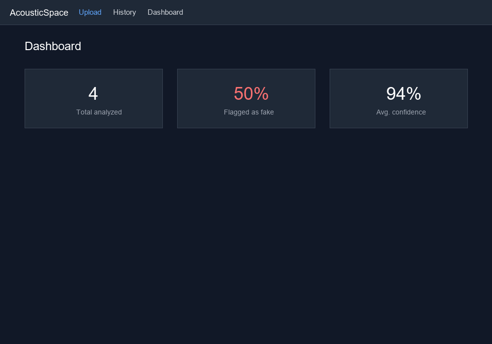
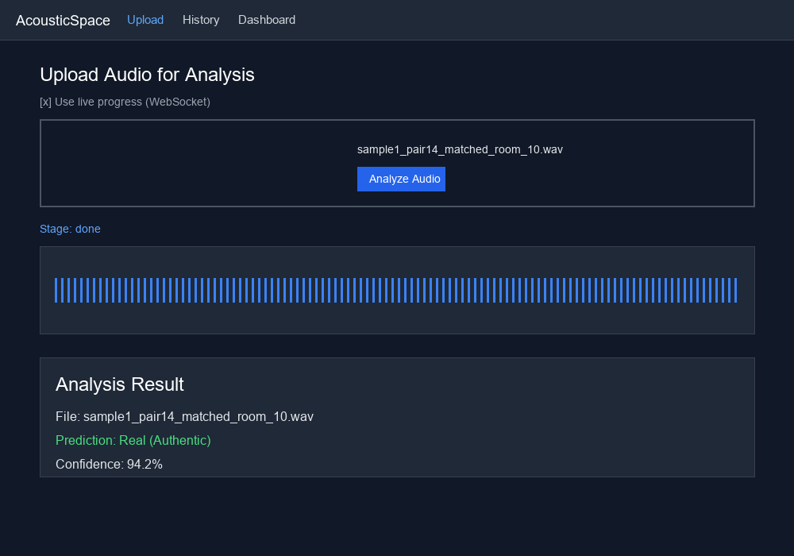
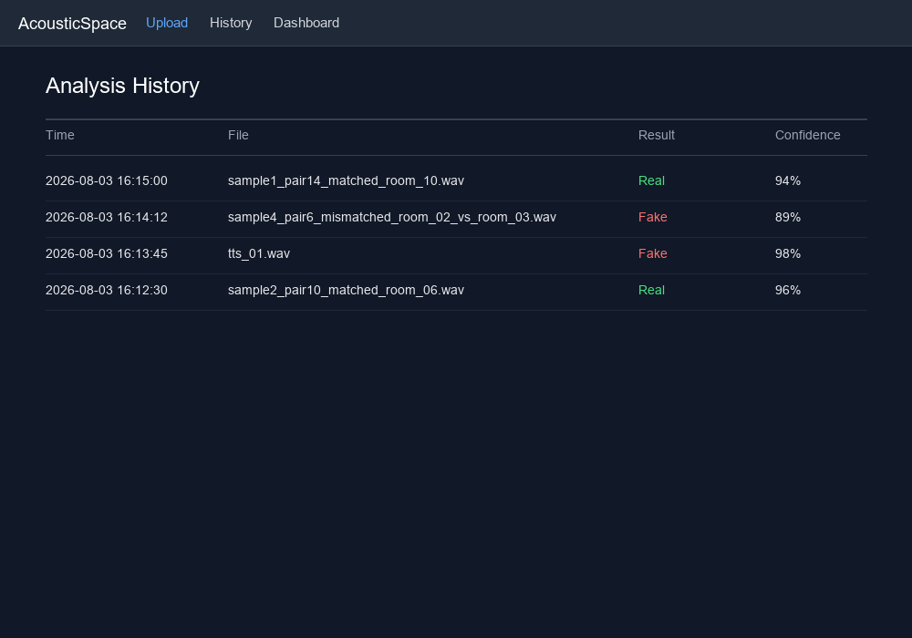

<div align="center">

# 🎙️ AcousticSpace
### Deepfake Audio & Acoustic Environment Verification System

[](https://www.python.org/downloads/)
[](https://pytorch.org/)
[](https://fastapi.tiangolo.com/)
[](https://react.dev/)
[](https://vitejs.dev/)
[](https://tailwindcss.com/)
[](https://www.docker.com/)

*An end-to-end machine learning and web platform designed to detect synthetic speech and adversarial audio deepfakes by analyzing **Room Impulse Response (RIR) mismatch** and acoustic environment consistency.*

---

</div>

## 🌟 Overview

As generative AI audio models produce increasingly hyper-realistic speech, traditional artifact-based detection methods fall short. **AcousticSpace** introduces a physics-aware and environment-centric detection paradigm: **Acoustic Environment Consistency Testing**.

When synthetic or manipulated speech is spliced into an existing recording or generated with artificial room acoustics, the **Room Impulse Response (RIR)** across the waveform exhibits measurable inconsistencies. AcousticSpace analyzes spectral reverberation signatures, environmental decay rates, and spatial acoustic cues to distinguish authentic recordings from adversarial deepfakes.

### ✨ Key Accomplishments (Mid-Project Milestone)
- **End-to-End Full-Stack Web Application:** Built a responsive, dark-themed React + TypeScript + Vite frontend paired with a high-performance FastAPI asynchronous backend.
- **Dual-Mode Inference Engine:** Supports both instantaneous HTTP REST predictions (`/api/v1/predict`) and **real-time WebSocket streaming** (`/ws/predict`) for live stage-by-stage pipeline progress tracking.
- **Transformer-Powered Acoustic Classifier:** Utilizes a fine-tuned **Audio Spectrogram Transformer (`ASTForAudioClassification`)** integrated with specialized spectral feature extractors (`librosa`-based MFCC, Chroma, and Spectral Centroid analysis).
- **Adversarial RIR Dataset Generation:** Developed an automated synthesis pipeline that pairs clean speech with matched and mismatched room impulse responses (bathrooms, offices, large halls, small rooms) to train and evaluate robustness against evasion attacks.
- **Containerized Reproducibility:** Configured full multi-service Docker Compose orchestration with automated service healthchecks and proxy routing.

---

## 🏗️ System Architecture & Data Flow

AcousticSpace is structured as a decoupled three-tier system: the interactive UI layer, the API & validation service layer, and the core machine learning inference pipeline.

```
+-----------------------------------------------------------------------------------+
|                              Frontend (React + Vite)                              |
|                                                                                   |
|    +-----------------------+     +--------------------+    +-----------------+    |
|    | AudioUpload Component | <-> |   WebSocket Hook   |    |  History Table  |    |
|    +-----------------------+     +--------------------+    +-----------------+    |
+------------------------------------------+----------------------------------------+
                                           |
                         HTTP POST /api/v1/predict  |  WebSocket /ws/predict
                         HTTP GET  /history         |  (Live Stage Streaming)
                                           v
+-----------------------------------------------------------------------------------+
|                             Backend Service (FastAPI)                             |
|                                                                                   |
|    +-------------------------------------------------------------------------+    |
|    |  Endpoint Routers (/api/v1/predict, /ws/predict, /history, /health)    |    |
|    +-------------------------------------------------------------------------+    |
|                                          |                                        |
|    +-----------------------+             v                +------------------+    |
|    |   Validation & CORS   | -> +------------------+ ---> |   History Log    |    |
|    |  (Size, Header, Ext)  |    | Inference Engine |      |   (In-Memory)    |    |
|    +-----------------------+    +------------------+      +------------------+    |
+------------------------------------------+----------------------------------------+
                                           |
                                           v
+-----------------------------------------------------------------------------------+
|                              ML Pipeline Layer (PyTorch)                          |
|                                                                                   |
|    +-----------------------+    +------------------+     +-------------------+    |
|    |     Audio Loading     | -> | Feature Extract  | --> |   AST Classifier  |    |
|    |  (librosa / 16,000Hz) |    |  (MFCC, Chroma,  |     |  (MIT/ast-finetuned)|    |
|    |                       |    | Spectral Centroid|     |   Binary Output   |    |
|    +-----------------------+    +------------------+     +-------------------+    |
+-----------------------------------------------------------------------------------+
```

---

## 🔬 End-to-End Workflow Explained

### 1. Acoustic Dataset & RIR Synthesis (`ml/scripts/`)
- **Room Impulse Response Library (`download_rirs.py` / `generate_rirs.py`):** Simulates diverse acoustic environments, including small rooms, offices, bathrooms, and reverberant large halls.
- **Matched vs. Mismatched Pairing (`build_mismatch_dataset.py`):**
  - **Matched (Real):** Speech convolved with a consistent room impulse response throughout the audio file.
  - **Mismatched (Deepfake/Manipulated):** Speech segments convolved with conflicting RIRs (e.g., transitions from an office RIR to a bathroom RIR), mimicking spliced or synthetic audio generation.
- **Adversarial Robustness Testing (`run_attack_test.py`):** Evaluates model resilience against acoustic camouflage and RIR normalization attacks.

### 2. Audio Processing & Spectral Feature Extraction (`ml/scripts/extract_features.py`)
- **Standardization:** Input audio waveforms are automatically converted to **16 kHz mono** PCM streams.
- **Spectral Decomposition:** Computes spatial acoustic features:
  - **MFCCs (Mel-Frequency Cepstral Coefficients):** Captures vocal tract shape and envelope consistency.
  - **Spectral Centroid & Bandwidth:** Identifies unnatural frequency distributions common in vocoder-generated speech.
  - **Chroma Features & Decay Analysis:** Quantifies reverberative energy decay across time.

### 3. Model Inference (`ml/scripts/inference.py`)
- Uses a fine-tuned **Audio Spectrogram Transformer** (`MIT/ast-finetuned-audioset-10-10-0.4593`).
- Outputs a comprehensive prediction schema:
  - `is_fake`: Binary classification label (`true` for deepfake/mismatch, `false` for real).
  - `confidence`: Calibrated prediction confidence percentage (`0.000` to `1.000`).
  - `rir_mismatch_score`: Quantitative acoustic environment discrepancy score.
  - `breathing_score` & `flagged_segments`: Structured extensibility hooks for Week 3/4 feature additions.

### 4. Interactive UI & Analytics (`frontend/`)
- **Real-time Progress Indicator:** WebSocket streaming gives users immediate visual feedback as audio moves through loading, feature extraction, AST classification, and RIR scoring.
- **Analysis Dashboard & History:** Records every evaluation with timestamps, file metadata, confidence metrics, and aggregated deepfake detection statistics.

---

## 🖥️ UI & Application Preview

| Dashboard Overview | Audio Upload & Real-Time Analysis | Analysis History & Logging |
| :---: | :---: | :---: |
|  |  |  |

---

## 🚀 Quickstart & Setup Guide

### Option A: Complete Docker Deployment (Recommended for Review)
You can launch the entire full-stack application (frontend + backend + ML environment) with a single command:

```bash
docker compose up --build
```

- **Frontend UI:** Open [http://localhost:5173](http://localhost:5173) in your browser.
- **Backend API & Docs:** Visit [http://localhost:8000/docs](http://localhost:8000/docs) for Swagger UI or [http://localhost:8000/health](http://localhost:8000/health) for system health checks.

> [!NOTE]
> **Docker Build Notice:** Due to PyTorch and scientific computing libraries, initial Docker image construction takes approximately **3–5 minutes**. Subsequent runs use cached layers.

---

### Option B: Local Development Setup

#### 1. Backend Service (FastAPI)
```bash
# From repository root
python -m venv venv
venv\Scripts\activate          # Windows PowerShell
# source venv/bin/activate     # Linux / macOS

pip install -r backend/requirements.txt
python -m uvicorn backend.app.main:app --host 0.0.0.0 --port 8000 --reload
```

#### 2. Frontend Development Server (React + Vite)
```bash
cd frontend
npm install
npm run dev
```

#### 3. Standalone ML CLI Inference
Test any audio file directly against the machine learning pipeline:
```bash
python ml/scripts/inference.py data/samples/sample1.wav
```

---

## 📡 API Reference & Contract

### 1. HTTP Prediction Endpoint
- **URL:** `POST /api/v1/predict`
- **Content-Type:** `multipart/form-data`
- **Parameter:** `file` (Audio file: `.wav`, `.mp3`, `.flac`, `.ogg`, `.m4a` — max 20 MB)

#### Sample JSON Response:
```json
{
  "filename": "sample4_pair10_mismatched_room_06_vs_room_07.wav",
  "is_fake": true,
  "confidence": 0.932,
  "rir_mismatch_score": 0.815,
  "breathing_score": null,
  "flagged_segments": []
}
```

### 2. Live WebSocket Streaming Endpoint
- **URL:** `WS /ws/predict`
- **Protocol:** Send raw audio binary buffer; receive incremental JSON status updates (`"Extracting acoustic features..."`, `"Evaluating RIR mismatch..."`) followed by the final prediction object.

### 3. Analysis History
- **URL:** `GET /history`
- **Returns:** JSON array of recent analysis records and cumulative statistical metrics.

---

## 📁 Repository Structure

```text
infotact-project-AcousticSpace-Deepfake-Detection/
├── backend/                  # FastAPI Backend Service
│   ├── app/
│   │   ├── api/              # Route handlers (/predict, /ws/predict, /history)
│   │   ├── core/             # Application config & in-memory history manager
│   │   ├── schemas/          # Pydantic data validation schemas
│   │   └── main.py           # Application factory & CORS configuration
│   ├── tests/                # Automated pytest suites for API endpoints
│   └── requirements.txt      # Backend Python dependencies
├── frontend/                 # React 18 + TypeScript + Vite UI
│   ├── src/
│   │   ├── components/       # AudioUpload, WebSocket Hook, HistoryTable, Dashboard
│   │   ├── types/            # TypeScript interfaces & API response contracts
│   │   └── App.tsx           # Application layout & navigation router
│   ├── public/               # Static web assets
│   └── package.json          # Frontend dependencies & npm scripts
├── ml/                       # Machine Learning & Acoustic Analysis Layer
│   ├── checkpoints/          # Pretrained & fine-tuned AST model weights
│   ├── data/                 # Generated RIR datasets & adversarial test pairs
│   └── scripts/              # RIR synthesis, feature extraction, inference & training
├── docs/                     # Documentation & reference materials
│   ├── ARCHITECTURE.md       # Full architectural & data-flow specification
│   ├── api_contract.md       # API payload documentation
│   └── screenshots/          # UI review screenshots
├── docker-compose.yml        # Multi-container Docker orchestration
└── README.md                 # Project documentation (You are here!)
```

---

## 🗓️ Roadmap & Next Steps (Post Mid-Project)
- [ ] **Breathing-Pattern Detection Module:** Analyze respiratory interval anomalies and micro-pauses in synthetic speech.
- [ ] **Segment-Level Explainability (`flagged_segments`):** Highlight precise timestamp intervals where acoustic mismatch occurs on an interactive waveform visualizer.
- [ ] **Persistent Database Layer:** Migrate analysis history from in-memory storage to a persistent SQLite/PostgreSQL database.
- [ ] **Comprehensive EER Evaluation:** Execute full benchmark runs on expanded synthetic test sets to log official Equal Error Rate (EER) curves.

---

<div align="center">

**AcousticSpace** • Built for the Mid-Project Review & Technical Evaluation

</div>
