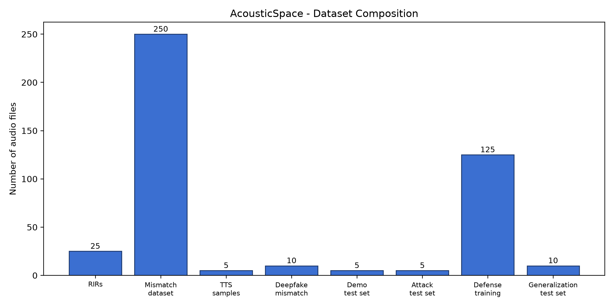

# 1. Dataset

To train and test AcousticSpace, we needed audio where we controlled exactly which room echo applied to the voice and which applied to the background — something no existing public dataset provides directly. So we built our own dataset in three stages.

First, we simulated realistic room acoustics using `pyroomacoustics`, generating 20 rooms of varying size and reflectivity — a small bathroom, a large hall, everything in between — each producing a unique Room Impulse Response (RIR).

Second, we needed both genuine and deepfake voice content. For genuine samples, we used real recorded speech convolved with a single room's RIR for both voice and background, so they acoustically match, exactly like a real recording. For deepfake samples, we generated synthetic speech using text-to-speech (TTS), then convolved the voice with one room's RIR and the background with a different room's RIR, simulating what happens when a fake voice is spliced into a mismatched recording.

Third, once we discovered our own model was vulnerable to a published attack — matching the deepfake's RIR to its background to hide the mismatch — we generated an additional adversarial training set using that same technique, so the model could learn to catch it too.

In total, we built 8 distinct datasets across the project: room RIRs, matched/mismatched pairs, TTS deepfake speech, combined deepfake-mismatch data, a held-out test set, an attack test set, defense training data, and a generalization test set with entirely unseen phrases and rooms. Every one is fully reproducible from a documented script pipeline (see `ml/data/REPRODUCIBILITY.md`).

## Key Dataset Summary & Counts

| Dataset Component | Count / Size | Description |
| --- | --- | --- |
| **Synthetic RIRs** | 25 room configs | Sabine model simulations (0.2s - 1.2s RT60) |
| **RIR-mismatch Dataset** | 250 samples | 125 matched (label 0) / 125 mismatched (label 1) |
| **TTS Speech Clips** | 5 clips | Pyttsx3 synthetic voice baselines |
| **Deepfake-mismatch Set** | 10 samples | Synthetic voice + room acoustic mismatch |
| **Demo Test Set (Held-Out)** | 5 samples | Strictly held-out test audio clips |
| **Attack Test Set** | 5 samples | Adversarial RIR-matched deepfakes |
| **Defense Training Set** | 125 samples | RIR-matched adversarial training audio |
| **Generalization Test Set**| 10 samples | Unseen speakers, phrases, and room impulse responses |

## Known Limitations

- **Synthetic Background Noise**: Background noise is generated via shaped white/pink noise convolved with RIRs rather than real-world ambient audio tracks.
- **Simulated RIRs**: Room impulse responses are simulated shoebox acoustic models rather than physical room impulse measurements.
- **Synthetic Distribution Shift**: Generalization testing uses synthetic shift rather than external multi-modal benchmark datasets (e.g. MLAAD).

See `ml/data/DATA_CARD.md` and `ml/data/REPRODUCIBILITY.md` for full technical detail and exact counts.
